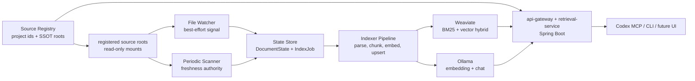

# local-rag-system-development-direction

- Type: design
- Domain: local-rag-system
- Owner:
- Created: 2026-05-24
- Updated: 2026-05-24
- Referenced By:
  - `docs/projects/P0001-local-rag-system.md`
  - `docs/tasks/T0001-source-registry-project-ssot-registration.md`

## Context

이 설계는 장비별 local source roots를 대상으로 하는 1인용 로컬 RAG 시스템의 개발 방향을 고정한다.

참조 원문은 기존 기획 노트 2개다. 원문 기준 핵심 요구는 다음이다.

- macOS 로컬 파일 시스템의 source folder를 직접 읽는다.
- 원본 source folder는 특정 노트 앱이 아니라 Markdown과 첨부파일이 있는 파일 시스템이다.
- 장비별로 실제 사용하는 프로젝트만 명시적 registry에 등록한다.
- 프로젝트별 repo `docs/`는 해당 프로젝트의 SSOT이고, 별도 등록된 compiled knowledge source는 cross-project reference와 planning/meta layer로 분리한다.
- 변경된 파일만 재인덱싱하고, 삭제와 이름 변경도 index에 반영한다.
- local embedding model과 local LLM만 사용한다.
- 검색은 vector 단독이 아니라 BM25/keyword + vector + rerank로 진화 가능한 hybrid retrieval이어야 한다.
- Codex, CLI, future UI가 같은 검색 API를 사용한다.
- Docker Compose로 로컬에서 쉽게 실행한다.
- 장기 유지보수 관점에서는 Java/Spring Boot 중심 구조를 우선한다.

이 저장소에는 초기 Python 표준 라이브러리 기반 BM25 검색 scaffold가 있었지만 active runtime surface에서 제거했다. 원문 요구의 장기 목표인 watcher, 증분 인덱싱, Weaviate hybrid search, MCP 연동을 닫는 구현 경로는 Spring Boot MSA로 단일화한다.

## Whole-System Role

이 문서는 `local-rag-system`의 방향 전환 기준이다. 제품 방향은 `Spring Boot MSA services + SourceRegistry + PostgreSQL + Weaviate + Ollama + file watcher/scanner + MCP bridge`로 고정한다.

`docs/design/control-plane.md`에서 이 문서는 active domain design surface다. `P0001 local-rag-system`과 후속 task는 이 문서를 읽고 구현 단위를 잘라야 한다.

## Boundary

포함하는 책임:

- source folder 변경 감지와 주기적 scan의 결합 전략
- 장비별 `SourceRegistry`와 `ProjectRegistration`을 통한 project-scoped source selection
- file state, content hash, index job 상태 관리
- Markdown 우선 parsing/chunking과 heading-aware chunk 생성
- Ollama embedding 호출과 local chat generation 연동
- PostgreSQL 기반 registry/state/job/failure/audit control store
- Weaviate 기반 BM25/vector hybrid retrieval
- Codex MCP 또는 REST bridge가 소비할 검색 API 계약
- Docker Compose 기준 local-only 운영 경계

포함하지 않는 책임:

- 특정 노트 앱 전용 플러그인 또는 런타임 화면 재현
- multi-user SaaS 권한 모델
- 특정 cloud provider 전용 동기화 프로토콜
- 1차 MVP의 OCR, PDF deep parsing, Excalidraw/canvas semantic parsing
- 외부 API로 private source content를 전송하는 모델 호출

외부 시스템과의 경계:

- Source folder: read-only mount로만 접근한다.
- Source registry: 어떤 source root가 indexing/search 대상인지 결정하는 machine-local control plane이다.
- Ollama: 기존 local/network Ollama endpoint를 사용하고, 모델 제공자는 이 시스템 밖의 operator prerequisite으로 둔다.
- Weaviate: vector/lexical index 저장소이며 재생성 가능한 derived state로 취급한다.
- Codex/CLI/UI: `api-gateway` 또는 `mcp-bridge`가 제공하는 동일한 search/index API를 소비한다.

## Source Registry And SSOT Registration

각 장비의 local RAG는 자신이 실제로 다루는 프로젝트만 등록한다. 등록되지 않은 repository나 archive는 디스크에 존재해도 indexing/search 대상이 아니다.

이 결정의 authoritative design은 `docs/design/source-registry-and-project-ssot.md`다.

핵심 계약:

- `project_id`는 Codex/RAG skill이 사용하는 stable key다. 예: `project-alpha`, `project-beta`, `personal-notes`.
- `source_id`는 실제 indexing root를 가리킨다. 권장 형식은 `project_id.layer`다. 예: `project-alpha.docs`, `personal-notes`.
- repo `docs/`는 해당 repo의 `project-current-truth`다.
- compiled knowledge source는 `compiled-wiki`로, cross-project synthesis와 개인 wiki memory를 제공한다.
- planning/meta source는 repo SSOT가 아니라 `planning-meta`로 취급한다.
- Codex-facing search는 `project_id`를 받아 현재 프로젝트 SSOT를 먼저 검색하고, `default_context`에 포함된 compiled knowledge source를 그 다음에 검색한다.
- source registration은 operator action이다. Codex search call이 임의로 새 source root를 등록하면 안 된다.

Registry metadata는 모든 chunk에 전달되어야 한다. 최소 metadata는 `device_id`, `project_id`, `source_id`, `source_type`, `ssot_role`, `relative_path`, `sensitivity`, `write_policy`다.

## Domain Model

주요 엔티티:

- `DeviceProfile`: local machine의 active registry profile.
- `ProjectRegistration`: `project_id`, repo path, primary SSOT source, default context를 묶는 project entry.
- `SourceRoot`: indexing 대상 root directory와 policy를 나타내는 registry entry.
- `SourceFolder`: 인덱싱 대상 root directory.
- `SourceDocument`: source folder 아래의 개별 원본 파일.
- `DocumentState`: path, size, mtime, sha256, indexing status를 저장하는 정합성 기준.
- `IndexJob`: 신규/변경/삭제 파일에 대해 생성되는 처리 작업.
- `Chunk`: 검색 단위로 저장되는 heading-aware text segment.
- `Embedding`: chunk content로부터 생성된 dense vector.
- `SearchCandidate`: hybrid retrieval이 반환한 raw candidate.
- `SearchResult`: dedupe, filter, optional rerank, citation 생성을 거친 최종 결과.
- `FailureRecord`: 읽기, parsing, embedding, upsert 실패를 버리지 않고 재시도 가능하게 남기는 기록.
- `SearchScope`: `project_id`, source priority, include/exclude filters를 바탕으로 결정된 retrieval 대상 집합.

주요 값 객체:

- `DocumentId`: path 기반 stable id 또는 canonical path hash.
- `ChunkId`: document id + chunk index/hash.
- `HeadingPath`: Markdown heading hierarchy.
- `SourcePath`: source root 기준 relative path.
- `SourceId`: registry 안에서 source root를 식별하는 stable id.
- `ProjectId`: Codex/RAG skill, registry, index metadata가 공유하는 stable project key.
- `SsotRole`: source가 project current truth인지, compiled wiki인지, planning/meta인지 구분하는 role.
- `ContentHash`: sha256 content fingerprint.
- `Sensitivity`: frontmatter 또는 path rule에서 얻는 private/work classification.
- `RetrievalScore`: bm25, vector, rerank score를 분리해서 보존하는 score tuple.

주요 상태 전이:

```text
unseen -> detected -> queued -> indexing -> indexed
indexed -> changed -> queued -> indexing -> indexed
indexed -> deleted -> removing -> removed
queued/indexing -> failed -> queued
```

## Invariants

- 원본 source folder는 read-only로 취급한다.
- index와 state store는 언제든 재생성 가능한 derived data다.
- watcher event만으로 freshness를 보장하지 않는다. periodic scanner가 최종 정합성 기준이다.
- 파일 변경 판단은 path, mtime, size만으로 끝내지 않고 sha256을 최종 diff key로 사용한다.
- 변경 파일은 기존 document chunks를 삭제한 뒤 upsert한다.
- 삭제 파일은 검색 결과에서 사라져야 한다.
- embedding/chat 호출은 local endpoint로만 나가야 한다.
- retrieval API는 검색 엔진 교체를 숨기는 interface 뒤에 둔다.
- 검색 결과는 source path, heading, snippet, score breakdown, citation을 포함해야 한다.
- 실패는 조용히 삼키지 않고 `FailureRecord`와 index status에 남긴다.

## Failure Boundaries

이 설계 안에서 흡수하는 실패:

- 파일이 쓰이는 중이라 읽을 수 없는 경우 failure queue에 남기고 다음 scan에서 재시도한다.
- watcher 이벤트 누락, 중복, 순서 뒤바뀜은 scanner와 debounce로 보정한다.
- embedding/upsert 일시 실패는 job status와 retry policy로 흡수한다.
- parsing 대상이 아닌 파일은 skipped status와 reason을 남긴다.

상위 운영 또는 downstream으로 넘기는 실패:

- source folder 권한 자체가 없는 경우 operator prerequisite 실패로 노출한다.
- Ollama model 미설치 또는 endpoint unreachable은 health/status에서 operator action으로 노출한다.
- Weaviate schema migration이 필요한 경우 migration task로 분리한다.

절대 조용히 삼키지 않는 실패:

- private source content가 외부 API로 전송될 가능성
- 삭제된 문서가 검색 결과에 계속 노출되는 stale index
- state store와 search index의 document count가 지속적으로 불일치하는 상태
- citation path를 만들 수 없는 검색 결과

## Interfaces

내부 인터페이스:

```java
interface SourceScanner {
    ScanSummary scan(SourceFolder sourceFolder);
}

interface SourceRegistry {
    ProjectRegistration getProject(String projectId);
    List<SourceRoot> resolveSources(SearchScope scope);
}

interface Indexer {
    IndexResult index(SourceDocument document);
    DeleteResult delete(SourcePath path);
}

interface Embedder {
    List<Float> embed(String text);
}

interface Retriever {
    List<SearchCandidate> retrieve(SearchQuery query);
}

interface Reranker {
    List<SearchResult> rerank(SearchQuery query, List<SearchCandidate> candidates);
}
```

외부 REST API:

```http
GET  /api/registry/projects
GET  /api/registry/sources
POST /api/registry/validate
GET  /api/index/status
POST /api/index/scan
POST /api/index/force
GET  /api/index/failures
POST /api/search
GET  /api/documents/{documentId}
```

Codex MCP tools:

```text
rag_list_projects
rag_list_sources
rag_search
rag_get_document
rag_index_status
rag_force_scan
```

입력/출력 계약:

- Search input은 query, limit, mode, filters, rerank flag를 받는다.
- Search output은 path, heading, score breakdown, snippet, citation, source metadata를 반환한다.
- Index status는 document/chunk count, last scan time, pending jobs, failed jobs, stale documents를 반환한다.

## Development Direction

### Target Architecture



### Runtime Shape

1차 운영 단위는 Docker Compose다.

- `api-gateway`: public local REST entrypoint.
- `source-registry-service`: source registry loading, validation, scope resolution.
- `indexer-service`: scanner, watcher, state diff, index job orchestration, chunking, embedding, upsert/delete.
- `retrieval-service`: hybrid retrieval, filters, citation, optional answer generation.
- `mcp-bridge`: Codex-facing MCP tools.
- `postgres`: source registry, document state, index jobs, failures, search audit.
- `weaviate`: hybrid search engine. `DEFAULT_VECTORIZER_MODULE=none`으로 두고 embedding은 indexer-service가 생성한다.
- `ollama`: 기본 compose에는 포함하지 않고 기존 endpoint를 사용한다. 독립 실행 profile은 후속 task로 추가할 수 있다.

### Phasing

Phase 0, design lock:

- 이 문서와 `P0001`을 기준으로 MVP 경계를 고정한다.
- `docs/design/source-registry-and-project-ssot.md`를 기준으로 project/source registry contract를 고정한다.
- Docker Compose port, volume, model name, source mount policy를 확정한다.
- active runtime surface는 Spring Boot MSA만 남긴다.

Phase 1, indexing MVP:

- Spring Boot MSA service scaffold를 생성한다.
- source registry loader/validator와 `project_id` 기반 search scope resolver를 구현한다.
- source scanner, file watcher, debounce, document state diff를 구현한다.
- Markdown frontmatter/heading parser와 chunker를 구현한다.
- Ollama embedding과 Weaviate schema/upsert를 연결한다.

Phase 2, search API:

- Weaviate hybrid search를 `Retriever` 뒤에 둔다.
- query normalization, exact/path hint boost, metadata filter, dedupe, citation을 구현한다.
- CLI 또는 minimal HTTP smoke로 검색 품질을 확인한다.

Phase 3, Codex integration:

- MCP tool 또는 REST bridge를 구현한다.
- `rag_search`, `rag_get_document`, `rag_index_status`, `rag_force_scan` smoke test를 만든다.

Phase 4, quality improvement:

- multilingual reranker를 붙인다.
- evaluation query set을 만들고 검색 회귀를 측정한다.
- Markdown link graph expansion을 추가한다.

Phase 5, attachment expansion:

- PDF, txt, docx, canvas, Excalidraw, OCR 처리를 task 단위로 확장한다.

## Artifact Contracts

이 설계가 authoritative truth로 잠그는 산출물:

- `docs/design/local-rag-system-development-direction.md`
- `docs/design/msa-runtime-and-storage.md`
- `docs/projects/P0001-local-rag-system.md`
- 후속 implementation task의 source of truth가 될 component boundary, invariants, API list

이 설계를 입력으로 읽는 문서:

- `docs/projects/P0001-local-rag-system.md`
- Spring Boot service scaffold task
- MSA runtime baseline task
- Docker Compose baseline task
- Indexer/search/MCP implementation tasks

설계 변경 시 같이 갱신해야 하는 문서:

- `docs/design/control-plane.md`
- `docs/design/ubiquitous-language.md`
- `docs/design/README.md`
- `docs/_indexes/design-map.md`
- `docs/_indexes/active-docs.md`
- `docs/projects/P0001-local-rag-system.md`

## Quality Axes

- WHOLE: Java/Spring MSA 방향으로 구현 경로가 단일화되어야 한다.
- SCOPE: MVP는 Markdown, watcher/scanner, embedding, Weaviate hybrid, search API로 제한한다.
- EVIDENCE: indexing freshness, deletion propagation, search result citation, local-only model 호출은 smoke evidence가 필요하다.
- HANDOFF: 각 phase는 다음 task가 바로 구현할 수 있는 API, state, operational prerequisite을 넘겨야 한다.
- SECURITY: private source content는 local-only boundary를 벗어나면 안 된다.

## Decisions

| Decision | Rationale |
| --- | --- |
| 장비별 source registry를 둔다. | local RAG는 해당 장비에서 실제로 다루는 프로젝트만 검색해야 retrieval noise와 민감 자료 노출을 줄일 수 있다. |
| repo `docs/`를 project SSOT로, compiled knowledge source를 cross-project reference로 구분한다. | planning/meta note가 repo current truth를 대체하면 ownership boundary가 흐려진다. |
| Python BM25 scaffold는 active runtime surface에서 제거하고 target은 Spring Boot MSA로 단일화한다. | 유지보수 언어와 구현 경로를 줄여 다음 Codex 세션이 잘못된 baseline을 확장하지 않게 한다. |
| MVP 검색 엔진은 Weaviate로 둔다. | BM25/vector hybrid와 metadata filter를 한 구성요소에서 제공하고 Docker Compose 운영이 단순하다. |
| watcher와 scanner를 함께 사용한다. | macOS watcher event는 누락/중복 가능성이 있으므로 scanner가 freshness authority가 되어야 한다. |
| watcher event는 debounce 후 scan한다. | indexing이 embedding model을 호출하므로 editor autosave burst가 여러 번의 LLM 호출로 증폭되지 않아야 한다. 기본값은 마지막 이벤트 후 10초다. |
| source folder는 read-only mount로 둔다. | 원본 노트를 검색 시스템이 변형하지 않는다는 운영 invariant를 보존한다. |
| embedding/chat은 Ollama local endpoint만 사용한다. | private source content가 외부 API로 나가지 않아야 한다. |
| retrieval은 `Retriever` interface 뒤에 둔다. | Weaviate에서 Qdrant/OpenSearch로 교체할 가능성을 보존한다. |
| rerank와 graph expansion은 MVP 이후로 둔다. | hybrid search와 citation이 먼저 안정화되어야 품질 개선의 기준선이 생긴다. |

## Open Questions

- Weaviate schema에서 document와 chunk를 단일 collection으로 둘지, 별도 collection/reference로 둘지 결정해야 한다.
- source registry를 YAML-only로 둘지, PostgreSQL에 normalized registry snapshot도 저장할지 결정해야 한다.
- Docker Compose의 Ollama endpoint 기본값은 container에서 host Ollama를 볼 수 있는 `http://host.docker.internal:11434`로 두고, 장비별 direct-network endpoint는 untracked env file로 분리한다.
- Codex 연동은 REST bridge 위에 stdio MCP adapter를 붙이는 방식으로 시작한다.
- Spring Boot service skeleton을 Gradle multi-project로 둘지 Maven multi-module로 둘지 결정해야 한다.

## References

- `source:planning/local-rag-system-project-note`
- `source:planning/local-rag-system-design-note`
- `source:planning/source-registry-ssot-strategy-note`
- `README.md`
- `docs/architecture.md`
- `docs/design/source-registry-and-project-ssot.md`

## Change Log

- 2026-05-24: 원문 2개와 현 저장소 Python scaffold를 기준으로 개발 방향 design 문서 생성.
- 2026-05-24: 장비별 source registry, project SSOT registration, compiled knowledge source 결정을 개발 방향에 반영.
- 2026-05-24: 단일 application server 방향을 Spring Boot MSA services, PostgreSQL control store, Weaviate retrieval index 방향으로 갱신.
- 2026-05-24: Python BM25 scaffold 제거 결정을 반영하고 active implementation target을 Spring Boot MSA로 단일화.
