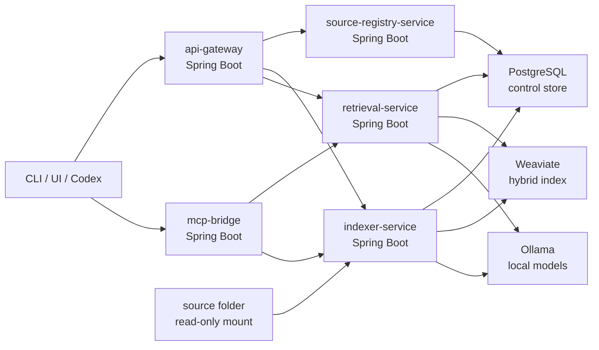

# msa-runtime-and-storage

- Type: design
- Domain: runtime
- Created: 2026-05-24
- Updated: 2026-05-24
- Referenced By:
  - `docs/projects/P0001-local-rag-system.md`
  - `docs/tasks/T0002-msa-runtime-baseline.md`

## Purpose

이 문서는 Local RAG System을 Docker Compose로 쉽게 실행할 수 있는 내부 MSA 구조와 storage contract를 고정한다.

목표 runtime은 Java/Spring Boot service 여러 개와 PostgreSQL, Weaviate를 Compose로 묶은 local-only system이다. 초기 Python BM25 scaffold는 active runtime surface에서 제거했다.

## Runtime Goals

- `docker compose`가 전체 local RAG runtime의 단일 진입점이다.
- 각 application service는 repository 안의 독립 하위 프로젝트로 위치한다.
- 서비스 간 책임은 명확히 분리한다.
- source folder는 read-only mount로만 접근한다.
- PostgreSQL은 registry/state/job/audit control store다.
- Weaviate는 BM25/vector hybrid retrieval index다.
- Ollama는 외부 prerequisite endpoint이며 compose 기본 구성에는 포함하지 않는다.
- 모든 public port는 `127.0.0.1`에 bind한다.

## Service Topology



## Application Services

| Service | Local Port | Responsibility | Directory |
| --- | ---: | --- | --- |
| `api-gateway` | `42120` | local REST entrypoint and delegation surface | `services/api-gateway/` |
| `source-registry-service` | internal `42141` | registry load, validation, source scope resolution | `services/source-registry-service/` |
| `indexer-service` | internal `42142` | watcher, scanner, state diff, chunking, embedding, index upsert/delete | `services/indexer-service/` |
| `retrieval-service` | internal `42143` | hybrid search, filter, dedupe, citation, optional answer generation | `services/retrieval-service/` |
| `mcp-bridge` | internal `42144` | MCP tools for Codex and other agents | `services/mcp-bridge/` |

All service directories are Spring Boot Maven subprojects. The current Dockerfiles define the artifact convention:

```text
services/<service>/target/<service>-0.1.0.jar
```

## Infrastructure Services

| Service | Local Port | Purpose |
| --- | ---: | --- |
| `postgres` | `42130` | source registry, document state, jobs, failures, audit |
| `weaviate` | `42131`, `42132` | BM25/vector hybrid retrieval index |

Ollama is configured through `LOCAL_RAG_OLLAMA_BASE_URL`. The portable default is `http://localhost:11434`; device-specific direct-network endpoints belong only in an untracked local env file.

## Storage Contracts

Authoritative storage files:

- `database/postgres/ddl/001_core_schema.sql`
- `database/weaviate/local-rag-chunk.schema.json`

PostgreSQL tables:

| Table | Owner | Purpose |
| --- | --- | --- |
| `device_profile` | source-registry-service | machine profile metadata |
| `project_registration` | source-registry-service | stable project ids and primary source selection |
| `source_root` | source-registry-service | registered source folders and policies |
| `document_state` | indexer-service | source file freshness and indexing status |
| `chunk_state` | indexer-service | chunk-to-document and chunk-to-Weaviate mapping |
| `index_job` | indexer-service | scan/index/delete/force job lifecycle |
| `failure_record` | indexer-service | retryable and terminal failures |
| `search_audit` | retrieval-service | query mode, scope, result count, latency |

Weaviate collection:

```text
LocalRagChunk
```

The collection stores chunk content, source metadata, ssot role, sensitivity, path, heading, tags, links, and external vectors generated by the indexer.

## Compose Contract

Top-level runtime files:

- `docker-compose.yml`
- `.env.example`
- `config/source-registry.example.yaml`
- `config/source-registry.local.example.yaml`

Minimum local startup flow after service implementation:

```bash
cp .env.example .env
# edit LOCAL_RAG_PERSONAL_NOTES_DIR, LOCAL_RAG_PROJECT_ALPHA_DOCS_DIR,
# LOCAL_RAG_PROJECT_BETA_DOCS_DIR, and LOCAL_RAG_DATA_DIR
# optionally set LOCAL_RAG_SOURCE_REGISTRY to /config/source-registry.yaml
docker compose --env-file .env up -d --build
```

The current Compose baseline supports three read-only source mounts:

| Container Path | Host Env Var | Intended Source |
| --- | --- | --- |
| `/source/personal-notes` | `LOCAL_RAG_PERSONAL_NOTES_DIR` | compiled Personal Notes wiki layer |
| `/source/project-alpha-docs` | `LOCAL_RAG_PROJECT_ALPHA_DOCS_DIR` | Project Alpha docs |
| `/source/project-beta-docs` | `LOCAL_RAG_PROJECT_BETA_DOCS_DIR` | Project Beta docs |

Expected public endpoints:

```http
GET  http://127.0.0.1:42120/api/health
GET  http://127.0.0.1:42120/api/index/status
POST http://127.0.0.1:42120/api/search
```

## Runtime Invariants

- No service binds public APIs to `0.0.0.0` by default.
- Source folders are mounted read-only.
- Unregistered folders are not indexed.
- PostgreSQL and Weaviate data live under `LOCAL_RAG_DATA_DIR`.
- Weaviate is derived state and can be rebuilt from PostgreSQL + source folders.
- PostgreSQL state is the operational truth for freshness, failures, and jobs.
- Search results must include source metadata and citation data.
- Deletion from source must delete stale retrieval chunks.

## Implementation Order

1. Create Maven multi-module skeleton for the five services.
2. Implement `source-registry-service` config loader and validation.
3. Implement `api-gateway` health and registry proxy.
4. Implement `indexer-service` scanner and state diff with PostgreSQL.
5. Add Markdown chunking, Ollama embedding, and Weaviate upsert/delete.
6. Implement `retrieval-service` hybrid search.
7. Implement `mcp-bridge`.
8. Add compose smoke validator.

## Open Decisions

- Whether service-to-service contracts should remain plain REST DTOs or move to generated clients later.
- Whether `mcp-bridge` should be stdio-only, HTTP MCP, or both.
- Whether `api-gateway` remains thin or later absorbs UI serving.
- Whether reranker becomes a library inside `retrieval-service` or a sixth service.

## Change Log

- 2026-05-24: MSA runtime, Docker Compose, PostgreSQL DDL, Weaviate schema, and service boundaries added as current runtime design.
