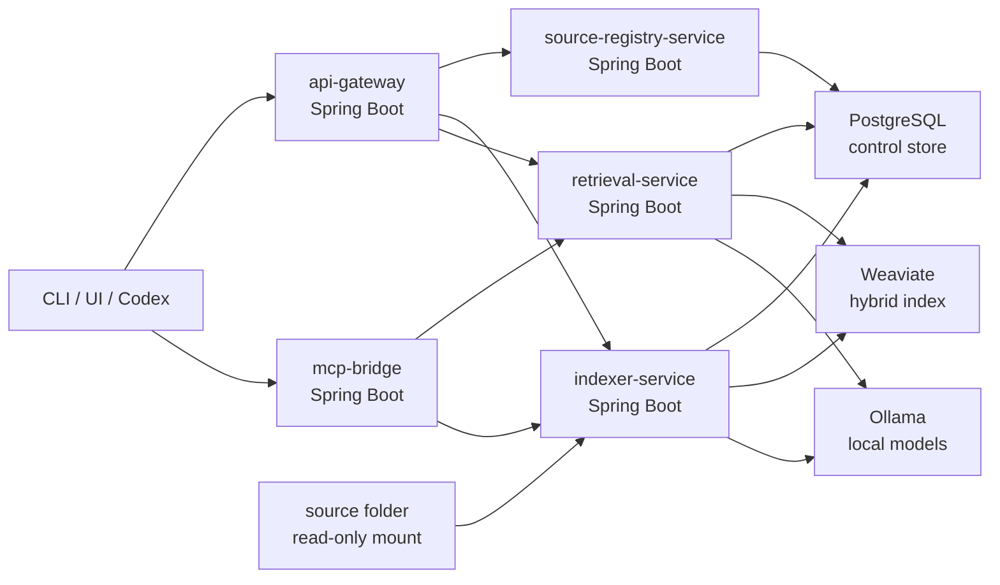

# msa-runtime-and-storage

- Type: design
- Domain: runtime
- Created: 2026-05-24
- Updated: 2026-09-04
- Referenced By:
  - `docs/projects/P0001-local-rag-system.md`
  - `docs/tasks/T0002-msa-runtime-baseline.md`
  - `docs/tasks/T0025-ollama-qwen38-chat-cutover.md`
  - `docs/tasks/T0026-m4-rag-query-bulk-zone-binding.md`

## Purpose

이 문서는 Local RAG System을 Docker Compose로 쉽게 실행할 수 있는 내부 MSA 구조와 storage contract를 고정한다.

목표 runtime은 Java/Spring Boot service 여러 개와 PostgreSQL, Weaviate를 Compose로 묶은 local-only system이다. 초기 Python BM25 scaffold는 active runtime surface에서 제거했다.

## Runtime Goals

- `docker compose`가 전체 local RAG runtime의 단일 진입점이다.
- 각 application service는 repository 안의 독립 하위 프로젝트로 위치한다.
- 서비스 간 책임은 명확히 분리한다.
- source folder는 read-only mount로만 접근한다.
- PostgreSQL은 registry/state/job/audit control store다.
- Weaviate는 BM25/vector hybrid retrieval index다.
- Ollama는 외부 prerequisite endpoint이며 compose 기본 구성에는 포함하지 않는다.
- 모든 public port는 `127.0.0.1`에 bind한다.

## Service Topology



## Application Services

| Service | Local Port | Responsibility | Directory |
| --- | ---: | --- | --- |
| `api-gateway` | `42120` | local REST entrypoint and delegation surface | `services/api-gateway/` |
| `source-registry-service` | internal `42141` | registry load, validation, source scope resolution | `services/source-registry-service/` |
| `indexer-service` | internal `42142` | watcher, scanner, state diff, chunking, embedding, index upsert/delete | `services/indexer-service/` |
| `retrieval-service` | internal `42143` | hybrid search, filter, dedupe, citation, optional answer generation | `services/retrieval-service/` |
| `mcp-bridge` | internal `42144` | MCP tools for Codex and other agents | `services/mcp-bridge/` |

All service directories are Spring Boot Maven subprojects. The current Dockerfiles define the artifact convention:

```text
services/<service>/target/<service>-1.2.0.jar
```

## Infrastructure Services

| Service | Local Port | Purpose |
| --- | ---: | --- |
| `postgres` | `42130` | source registry, document state, jobs, failures, audit |
| `weaviate` | `42131`, `42132` | BM25/vector hybrid retrieval index |

Ollama is configured through `LOCAL_RAG_OLLAMA_BASE_URL` for backward compatibility and `LOCAL_RAG_OLLAMA_BASE_URLS` for ordered multi-endpoint operation. The Compose default is `http://host.docker.internal:11434` because application services run inside containers. Device-specific direct-network endpoints, such as a Mac mini Ollama host on the local network, belong only in an untracked local env file.

When `LOCAL_RAG_OLLAMA_BASE_URLS` is set, indexer and retrieval services try the comma-separated endpoints in order. In the M4 three-zone profile this list is used only for authenticated embedding requests: `retrieval-service` uses the query binding and `indexer-service` uses the bulk binding. Endpoint fallback is not a hosted-provider fallback and must remain within operator-owned local/LAN endpoints.

`LOCAL_RAG_CHAT_MODEL` remains an explicit machine-local answer-generation override outside the M4 three-zone profile. The M4 RAG zone is embedding-only, so its production profile leaves this value blank. In that state `/api/answer` fails before retrieval with `503 ANSWER_GENERATION_DISABLED`; callers use `/api/search` or `rag_search` and perform synthesis in their own authorized reasoning boundary. The service never borrows the Voice or Trade generation binding as an answer fallback.

### Authenticated M4 RAG zone bindings

M4 three-zone integration separates embedding traffic from answer-generation endpoints and from each other:

| Consumer | Canonical lane | Request model alias | Physical provenance | Expected dimension | Keep alive |
| --- | --- | --- | --- | ---: | ---: |
| `retrieval-service` | `rag-query` | `silverstone/rag-query:qwen3-4b-v2` | `qwen3-embedding:4b` | 2560 | 120 seconds |
| `indexer-service` | `rag-bulk` | `silverstone/rag-bulk:qwen3-4b-v2` | `qwen3-embedding:4b` | 2560 | 0 seconds |

These aliases are server-owned workload bindings, not installed Ollama model names. Each service reads its bearer token
from a private regular file, sends only the `Authorization` header and request alias, and never sends client-authored zone or
lane headers. Missing, unreadable, group/world-accessible or empty token files fail before a request. Wrong tokens fail at
the proxy. The proxy strips credentials before forwarding to the loopback backend.

The direct Ollama settings remain a development compatibility default. The tracked
`config/m4-rag-bindings.env.example` and Compose override contain only `.invalid`/placeholder values. Real LAN endpoints,
token host paths and the explicit blank answer-generation setting belong in untracked Service-zone configuration.

`RAG_EMBEDDING_BASE_URLS` is intentionally separate from `RAG_OLLAMA_BASE_URLS`: retrieval embedding may use the
authenticated RAG query binding while chat generation remains on its separately governed endpoint. `RAG_EMBEDDING_*`
values are injected independently into retrieval and indexer containers by Compose.

Before any vector publication, the complete embedding batch must have the expected vector count and 2560 dimensions.
Only then may the indexer delete/replace previous chunks. A proxy denial, missing identity or dimension mismatch leaves
the document in a retryable `changed` state and retains the prior Weaviate chunks. This is the RAG bulk checkpoint; the
proxy queue is never a durable job store. Published chunks record `embeddingModel`, `embeddingDimensions`,
`embeddingBindingId` and `embeddingLane` provenance.

## Storage Contracts

Authoritative storage files:

- `database/postgres/ddl/001_core_schema.sql`
- `database/weaviate/local-rag-chunk.schema.json`

PostgreSQL tables:

| Table | Owner | Purpose |
| --- | --- | --- |
| `device_profile` | source-registry-service | machine profile metadata |
| `project_registration` | source-registry-service | stable project ids and primary source selection |
| `source_root` | source-registry-service | registered source folders and policies |
| `document_state` | indexer-service | source file freshness and indexing status |
| `chunk_state` | indexer-service | chunk-to-document and chunk-to-Weaviate mapping |
| `index_job` | indexer-service | scan/index/delete/force job lifecycle |
| `failure_record` | indexer-service | retryable and terminal failures |
| `search_audit` | retrieval-service | query mode, scope, candidate/final counts, phase latency, top result, source distribution, score JSON |

Weaviate collection:

```text
LocalRagChunk
```

The collection stores chunk content, source metadata, ssot role, sensitivity, path, heading, tags, links, external vectors,
and the validated embedding model/dimension/binding/lane provenance generated by the indexer.

As of `T0013`, retrieval chunks also carry document governance metadata: title, document type, frontmatter status, authority, updated timestamp, supersedes/supersededBy, full heading path segments, heading depth, heading slug, and generated chunk context. PostgreSQL `document_state.metadata_version` drives derived-index reindexing when the metadata contract changes.

As of `T0016`, `search_audit` is an additive retrieval debugging surface. It stores candidate limit, raw/final candidate counts, embedding/Weaviate/weighting/total latency, top source/path, source distribution, and top score JSON without storing full private source snippets.

## Compose Contract

Top-level runtime files:

- `docker-compose.yml`
- `.env.example`
- `config/source-registry.example.yaml`
- `config/source-registry.local.example.yaml`

Minimum local startup flow after service implementation:

```bash
cp .env.example .env
# edit LOCAL_RAG_SOURCE_ROOT, LOCAL_RAG_HOST_SOURCE_*, and LOCAL_RAG_DATA_DIR
# optionally tune LOCAL_RAG_WATCH_DEBOUNCE_SECONDS for editor autosave behavior
# optionally set LOCAL_RAG_SOURCE_REGISTRY to /config/source-registry.yaml
docker compose --env-file .env up -d --build
```

The single-user operation-zone command defaults to `~/Service`, with code in `~/Service/code/local-rag-system`, config in `~/Service/config/local-rag-system`, runtime data in `~/Service/runtime/local-rag-system`, logs in `~/Service/logs/local-rag-system`, and the operator command in `~/Service/bin/local-rag`. On Dean's Mac, Service-zone deployments are registered with `~/Service/deploy/bin/personal-deploy`; that authority calls `~/Service/update_local-rag-system.sh`, records release evidence, and passes `BRANCH` or `DEPLOY_VERSION` so the Local RAG operator command can reset the operational checkout to `origin/main` or a validated tag before rebuilding. Generated operation env defaults use the notebook-local Ollama endpoint `http://host.docker.internal:11434`; a Mac mini or other LAN-local Ollama endpoint can be placed first in `LOCAL_RAG_OLLAMA_BASE_URLS` without changing committed files.

The current Compose baseline keeps the legacy sample `/source` mount and also supports generic read-only slots under `/sources` for machine-local RAG corpora:

| Container Path | Host Env Var | Intended Source |
| --- | --- | --- |
| `/source` | `LOCAL_RAG_SOURCE_ROOT` | parent folder for registered source paths |
| `/source/personal-notes` | `LOCAL_RAG_SOURCE_PERSONAL_NOTES` | sample Personal Notes source |
| `/source/project-alpha-docs` | `LOCAL_RAG_SOURCE_PROJECT_ALPHA_DOCS` | sample Project Alpha docs |
| `/source/project-beta-docs` | `LOCAL_RAG_SOURCE_PROJECT_BETA_DOCS` | sample Project Beta docs |
| `/sources/source-01` | `LOCAL_RAG_HOST_SOURCE_01` | machine-local source slot |
| `/sources/source-02` | `LOCAL_RAG_HOST_SOURCE_02` | machine-local source slot |
| `/sources/source-03` | `LOCAL_RAG_HOST_SOURCE_03` | machine-local source slot |
| `/sources/source-04` | `LOCAL_RAG_HOST_SOURCE_04` | machine-local source slot |
| `/sources/source-05` | `LOCAL_RAG_HOST_SOURCE_05` | machine-local source slot |
| `/sources/source-06` | `LOCAL_RAG_HOST_SOURCE_06` | machine-local source slot |
| `/sources/source-07` | `LOCAL_RAG_HOST_SOURCE_07` | machine-local source slot |
| `/sources/source-08` | `LOCAL_RAG_HOST_SOURCE_08` | machine-local source slot |

If real source folders do not fit these generic slots, the operator should add a local Compose override with additional read-only mounts and point registry paths at those container paths.

Expected public endpoints:

```http
GET  http://127.0.0.1:42120/api/health
GET  http://127.0.0.1:42120/api/index/status
POST http://127.0.0.1:42120/api/search
```

## Runtime Invariants

- No service binds public APIs to `0.0.0.0` by default.
- Source folders are mounted read-only.
- Unregistered folders are not indexed.
- PostgreSQL and Weaviate data live under `LOCAL_RAG_DATA_DIR`.
- Weaviate is derived state and can be rebuilt from PostgreSQL + source folders.
- PostgreSQL state is the operational truth for freshness, failures, and jobs.
- Search results must include source metadata and citation data.
- Deletion from source must delete stale retrieval chunks.

## Implementation Order

1. Create Maven multi-module skeleton for the five services.
2. Implement `source-registry-service` config loader and validation.
3. Implement `api-gateway` health and registry proxy.
4. Implement `indexer-service` scanner and state diff with PostgreSQL.
5. Add Markdown chunking, Ollama embedding, and Weaviate upsert/delete.
6. Implement `retrieval-service` hybrid search.
7. Implement `mcp-bridge`.
8. Add compose smoke validator.

## Open Decisions

- Whether service-to-service contracts should remain plain REST DTOs or move to generated clients later.
- Whether `mcp-bridge` should be stdio-only, HTTP MCP, or both.
- Whether `api-gateway` remains thin or later absorbs UI serving.
- Whether a future local model reranker becomes a library inside `retrieval-service` or a sixth service. P0002 does not ship a separate model reranker.

## Change Log

- 2026-05-24: MSA runtime, Docker Compose, PostgreSQL DDL, Weaviate schema, and service boundaries added as current runtime design.
- 2026-05-25: Compose source mounts generalized to portable `/sources/source-*` slots so real source names and host paths remain machine-local.
- 2026-05-29: Ollama configuration extended from a single base URL to an ordered local/LAN endpoint list with connection/read timeout controls.
- 2026-08-29: tracked/generated chat default and the current Service baseline moved to native Ollama `qwen3.8:latest`; embedding remains `qwen3-embedding:4b` and oMLX compatibility env remains empty.
- 2026-05-30: Storage contract extended for T0013 metadata-aware chunking and document authority indexing. `document_state` and `chunk_state` now carry metadata migration fields, and `LocalRagChunk` carries document authority/freshness/supersession and heading context metadata.
- 2026-05-31: P0002 closeout recorded that the release path uses deterministic governance ranking inside `retrieval-service`; a separate local model reranker remains future optional work only.
